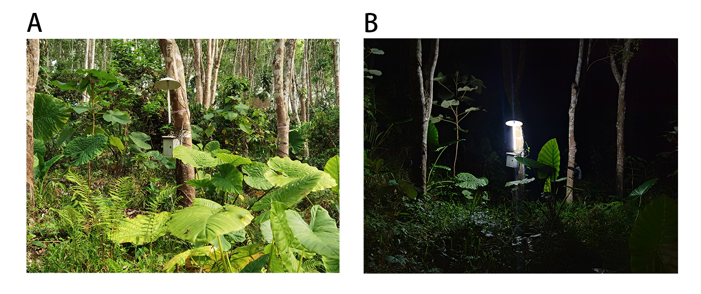

```{r setup, include=FALSE}
knitr::opts_chunk$set(echo = TRUE)
```

```{r, include=FALSE}
options(tinytex.verbose = TRUE)
```

```{r caching, include=FALSE}
library(knitr)
library(tidyverse)
library(methods)
options(kableExtra.auto_format = FALSE)
library(kableExtra)
```

\newpage

Impacts of artificial light at night on understory

$$ $$

Cong Zhou^1,2^,
Akihiro Nakamura^1^,
Masatoshi Katabuchi^1^,

$$ $$

^1^ CAS Key Laboratory of Tropical Forest Ecology, Xishuangbanna Tropical Botanical Garden, Chinese Academy of Sciences, Menglun, Yunnan 666303, China

^2^ University of Chinese Academy of Sciences, Beijing 100049, China

$$ $$

**Corresponding Authors**:

Masatoshi Katabuchi

E-mail: mattocci27@gmail.com

$$ $$

Manuscript received _______; revision accepted _______.

**Running title**:

\newpage

# ABSTRACT

Artificial light at night (ALAN), demonstrated a new ecological factors influences organism through multi-approach. 
As yet assessing impacts of artificial light at night on understory plants doesn't get much attentions.
We evaluated whether ALAN would affect the LMA (leaf mass per area) of understory plants through a two-year field light experiment in tropical rubber plant forest, China.
We assumed ALAN affected understory by two pathway of directly increasing light supplement aboveground and indirectly attracting insects then changing soil nutrients underground.
Two species were chosen in this study *Colocasia gigantea (Blume) Hook. f.* representing shade species and *Melastoma candidum D. Don* representing sun species.
Canopy openness, LMA value, soil nutrients and individual distance away from ALAN were measured.
We found a negative relationship between LMA value of understory and effects of ALAN, which was significant to species *Colocasia gigantea (Blume) Hook. f.* while non-significant to species *Melastoma candidum D. Don*.
Results suggests that ALAN might trigger comprehensive effects on understory.

**KEY WORDS**
leaf mass per area (LMA),
understory,
Artificial light at night (ALAN),
*Colocasia gigantea (Blume) Hook. f.* ,
*Melastoma candidum D. Don*

# INTRODUCTION

Light pollution caused by artificial light at night (ALAN) has disturbed ecological processes since the start of 20th century [@Longcore2004; @Gaston2013; @Bennie2016].
So far, artificial light at night extends both in intensity covered a large illuminance range from the degree hard to detect to almost daylight and in extent covered more and more World's terrestrial surfaces [@Bennie2016; @Falchi2016].
ALAN influences behavior or physiology broad ranges of taxonomic groups including mammals, birds, reptiles, amphibians, fishes, invertebrates, and plants [@Rich2006].
For example, ALAN attracts insects interfering in movement, foraging, reproduction, development so as an important bringer to drive insects population decline [@Owens2020; @Boyes2021].
Although many studies have focused on how ALAN change the behavior of animals [@Russart2018], its influence on plants has also received attentions [@Speisser2021a; Liu2022 Matthew effect].
A recent studies experimentally showed that ALAN increases biomass of herbaceous plants, which suggests ALAN can work as the light resources for plant growth [@Speisser2021a].
However, few studies have examined the effects of ALAN on plant functional traits in conditions close to their natural environment.

ALAN might directly affect plant leaf functional traits because ALAN could work as light resources.
Although LMA is driven by inherent genetic mechanisms [@Asner2011], environmental stresses (temperature, water and light) also shapes LMA.
Actually, plants could sense light through photorecpetors which allows the plant to respond to four parameters of their light environment: light spectral quality, light intensity, light direction, and light duration [@Rich2006; @Paik2019].
@Terashima2006 showed that the light-saturated rate of leaf photosynthesis per unit area ($P_max$) is highly correlated with leaf structural parameters such as leaf thickness, leaf mass per area, mesophyll surface area($S_mes$), and chloroplast surface area ($S_c$), and sun leaves are thicker than shade leaves exactly as the height of the palisade tissue in sun leaves is greater than that in shade leaves.
For individual species, LMA was proportional with species distributions along the insolation gradient, and was significantly higher in evergreen versus deciduous species [@Ackerly2002; @Niinemets2004; @Onoda2008].
And among a local community, @Ackerly2002 demonstrated the average values of LMA significantly increased with increasing potential diurnal insolation(PDI).
Here, ALAN could be considered as a conduct of prolonging light duration to plants so plants LMA could increase with that.

On the other hand, ALAN might indirectly affect plant leaf functional traits because ALAN has a potential to change soil environmental conditions by attracting insects.
Many kinds of insects orient themselves by maintaining a constant angle to light rays and are attracted by light [positive phototaxis? yes [@Baker1978; @Sotthibandhu1979]].
Previous studies showed that 30–40% of insects die soon after approaching street lamps for collision, overheating, dehydration, or predation [@Minnaar2015; @Owens2018].
Since nitrogen (N) and phosphorus (P) are the nutrients most frequently limiting primary productivity in forest ecosystems [@Wright2019], dead insects killed by ALAN could be important nutrient input for soil nutrient [@Behie2013].
Soil resources, especially N and P availability, are known to affect leaf mass per area (LAM) and leaf N and P contents [@Wright2004; @Riva2016], and those effects are known to be opposite to the effects of light [@Ackerly2002; @Hernandez-Vargas2019] (e.g., strong light increase LMA but high N availability decrease LMA).

Here, we investigated relationship between LMA of understory and the effects of ALAN through a two-year ALAN experiment in tropical rubber plant forest in south China.
Two species were chosen in this experiment representing sun species and shade species respectively to test whether different responds would show between them.
We assumed that ALAN would bring effect to understory in two pathway of aboveground part as direct light supplementary and undergound part as indirect soil nutrients supplementary.
Within our research hypothesis, we predicted that (a) LMA value of understory would decrease with growing ALAN's effects and (b) canopy-openness and its interaction with artificial light at night would show weak impaction in this experiment.

# MATERIALS AND METHODS

*experimental setup*

ALAN field experiments were located within the Xishuangbanna Tropical Botanical Garden (XTBG), China in rubber tree forest (N21°54' E101°16') where we totally set 5 plots and selected 2 plots for this experiment after field investiation.
LED (10w) is used to create an artificial light environment in all plots at night (fig.1).
The LED system included 6 components.
A metal box with an opening was used as a rainproof protector which was attached to a tree at around 1.2m from the ground.
A rechargeable lithium battery (12v/30Ah) and an electric timer controlled the timing and duration of the LED light operation at night.
An electric wire was used to connect battery and LED which was hanging from a tree branch with a lampshade at approximately 2 m from the ground.
Then the LED would work automatically from 8 pm to 5 am every day.
This experiment started from 2019 November, and leaf disc samples were collected on 2021 November.

*Species Selection*

Considering the understory conditions (mature individuals and distribution of individuals) and species specificity (it should be evergreen species and not be the nitrogen fix plants like *Leguminosae*) of each plot, finally two species respectively in two plots were chosen for our study, *Colocasia gigantea (Blume) Hook. f.* representing shade species and *Melastoma candidum D. Don* for sun species.

*Measurements*

We measured the horizontal distance and geographic orientation of each individual away from the LED using tape measure representing the relative effects of ALAN.
Canopy openness of each individual was on behalf of individual day light interception, which photographed by Nikon COOLPIX4500 with fish-eye lens (Nikon FC-e8) then measured using R package *LeafArea* [@Katabuchi2015].
For leaf mass per area (LMA), we used leaf disc (10mm^2) punched from leaf avoiding vein and leaf margin instead of whole-leaf to calculate individual mean LMA value [@Maenpuen2022].
We chose five healthy leaves then five leaf discs each leaf on species *Melastoma candidum D. Don* , and round five leaves then seven leaf discs on species *Colocasia gigantea (Blume) Hook. f.*.

For soil nutrients (N,C,P), we collected surface soil samples (0-10 cm depths) in five plots both in June 2019 and June 2022.
We took three replicates at the place under ALAN and the place 10m away from ALAN seperately each plot. 
After sampling, the soils were air-dried at room temperature for one week then sieved through 0.85mm and 0.15mm mesh finally used for total N,C measurements by combustion using a elemental analyzer (Vario MAX CN, Elementar Analysensysteme GmbH (Germany)) and total P measurement by inductively coupled plasma atomic-emission spectrometer (iCAP7400, Thermo Fisher Scientific U.S.A).
Then we calculated the relative percentage change of each nutrient between the value in 2019 and in 2022 to compare the soil nutrient change with ALAN's effect (sampled under ALAN) and without ALAN's effect (sampled 10m away from ALAN).  
$$
X_{2022}/X_{2019}, \ \ \ (X = C,N,P) 
$$

*Data Analysis*

To analyze the effects of ALAN, daylight's effect, and their interaction on both *Melastoma candidum D. Don* and *Colocasia gigantea (Blume) Hook. f.*, we fitted a Bayesian linear mixed-effets model for each species implemented in Stan [@Carpenter2017].
The Stan code used to fit the models is available from Github at https://github.com/Congon/light_project.
Leaf mass per area (LMA) of each leaf of each individual was the response variable.
Distance from the ALAN of each individual was transformed by log and reciprocal because the accumulation of insects and the intensity of ALAN fade away from distance nonlinearly.
We conducted individual as a random effect for each species on our model because individuals of the same species were non-independent.
All statistical analyses were conducted in R version 4.1.2 [@RCoreTeam2022]. 

# RESULTS

The effects of ALAN and daylight were significant for species *Colocasia gigantea (Blume) Hook. f.*, while species *Melastoma candidum D. Don* showed no significance.
Artificial light at night drove the averaged individual LMA value decrease for species *Colocasia gigantea (Blume) Hook. f.* (Table 1, slope: -0.1043 [95% CI: -0.1458, -0.0621]), and for species *Melastoma candidum D. Don* (Table 1, slope: -0.0422) although not significant.
Both species showed no significance on the interaction of the effects of ALAN and daylight (Table 1).
Loss of soil nutrients ($X_{2022}/X_{2019} < 1,\ (X = C,N,P)$) were observed in general among five plots from 2019 to 2022. 
The relative percentage change of each soil nutrient showed clear difference between the place under ALAN ($C_{2022}/C_{2019} = 0.919$, $N_{2022}/N_{2019} = 0.948$, $P_{2022}/P_{2019} = 0.537$) and the place 10m away from ALAN ($C_{2022}/C_{2019} = 0.663$, $N_{2022}/N_{2019} = 0.695$, $P_{2022}/P_{2019} = 0.492$) at the plot where *Colocasia gigantea (Blume) Hook. f.* disturbed, while showed not too much difference for the other species.

# DISCUSSION

Although it has been demonstrated that LMA increase with insolation [@Ackerly2002; @Niinemets2004], our research shows the effects of night artificial light to plants should be considered as a comprehensive situation.
Artificial light at night exerts an influence on the physiological processes of understory by multi-approach both aboveground and undergound.
For aboveground part, artificial light at night change the light environments of plants including light duration, light intensity and light spectral quality.
For underground part, artificial light at night might indirectly changed the soil nutrients conditions by attracting insects especially as an important nitrogen supplementary.
In this study, the LMA of understory shows a negative relationship with the composite effects of artificial light at night, thereinto the relationship between LMA and soil nutrients is consistent with previous studies.
Nevertheless we could not confirm the difference in the soil nutrients is due to artificial light at night, for soil nutrents were lost througthout rubber plant forest because of 
precipitation, terrain and rubber tapping although artificial light at night to some extent retarded the loss of soil nutrients in our experiment place.
Furthermore the results of understory response could vary according to the species specificity (sun species showed no significance in our study) and artificial light resource(varying intensities of artificial light could cause different results [@Bennie2016]).

There was research showed that plants' biomass would increase under artificial light through controlling experiment [@Speisser2021a], but our study showed the allocation of the changing part of biomass could be channelled into mixed results.
Controlling experiment probably tend to underestimate the species interaction and unpredictable environmental heterogeneity caused by natural and artificial factors, because many irreplaceable features of field conditions, such as subtle nutrients change, herbivores and competitors are usually absent.
Thus, adequate tests of the influence of artificial light at night on understory will entail more experimental work under field conditions.
In future work, diverse artificial light resource in light spectral quality and light intensity and more understory group are needed to simulate comprehensive effcts of artificial light from plant physiology to plant community.
In conclusion, the general pattern how understory species responds to artificial light at night remains unknown. 
Our study showed the LMA value of some understory species would decrease with artificial light at night.
This negative effect could indicate that increments of artificial light at night might bring about a physiological suppression to those understory plants.


# ACKONWLEGEMENTS


# AUTHOR CONTRIBUTIONS

MK and CZ conceived the study;
CZ collected data and performed the analysis with MK together;
all authors contributed to revisions.


# LITERATURE CITED

<div id="refs"></div>

\newpage

**Fig. 1.**
The distribution of individuals around the ALAN and the illustration of the experiment setup.
The distribution of individuals LMA values around the artificial light of two experimental species (A and C). 
Photographs of the experimental plots during the day and night (B and D).



\newpage

```{r table, echo=FALSE}
table <- read.csv("../data-raw/table.csv")%>%
  kbl(caption = "Coefficients table") %>%
  kable_paper("striped", full_width = F) %>%
  column_spec(4, bold = c(F,F,F,T,T,F)) %>%
  pack_rows("Melastoma_candidum", 1, 3) %>%
  pack_rows("Colocasia_gigantea", 4, 6)
table
```

**Table. 1.**
Results of Bayesian general linear mixed-effect models testing the effects of artificial light at night, daylight and interaction on experimental species.
Significant effects (p < 0.05) are in bold.

\newpage